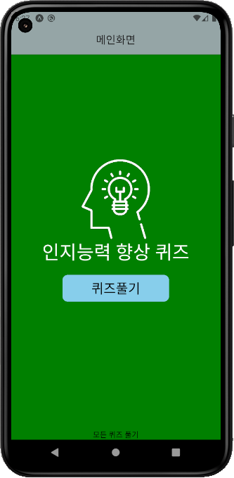

# :question:인지능력향상퀴즈

## :bulb:프로젝트 소개

**프로젝트 기간** : 2024.05 ~ 2024.06 
**인원** : 3인  
React-Native를 이용하여 제작한 첫 프로젝트로, 3인 협업으로 진행하여 팀원마다 1~2개의 퀴즈를 담당하여 총 5개의 퀴즈를 출제합니다.
노인들을 대상으로 노인들의 인지능력 향상을 위한 간단한 퀴즈를 주제로 제작되었습니다.

## :clipboard:기술스택

## :computer:주요화면
### 주요 퀴즈화면

- 닭, 안경, 자전거 세 가지의 사진이 랜덤한 개수와 위치에 출력되며 알맞은 개수를 입력합니다.

- 숫자 3,6,9가 포함된 부분을 모두 터치하여 체크합니다.

### 시연

## :notebook:비고
